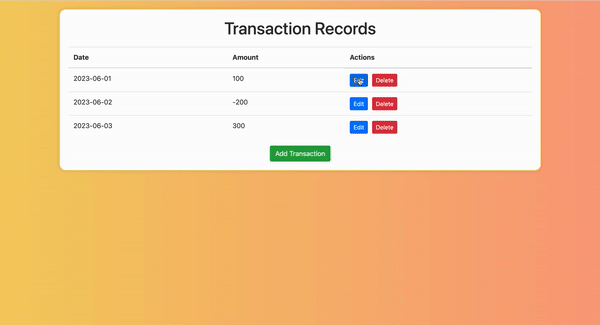

# Simple Transactions record app in Flask
### Project Description
#### This simple app lets you perform all the CRUD operations

#
Buiding this app is an assignment in IBM course: [Developing Ai Applications with Flask and python](https://www.coursera.org/learn/python-project-for-ai-application-development)
The course is part of 9 courses series in [IBM Backend Development Professional Certificate](https://www.coursera.org/professional-certificates/ibm-backend-development).
#
Additional features like ' Search functionality ' and ' Checking total balance functionality ' have also been added to the app apart from the CRUD operations shown in below demo.
#
<code>This is a sample demo of how the application looks & works:</code>
#

